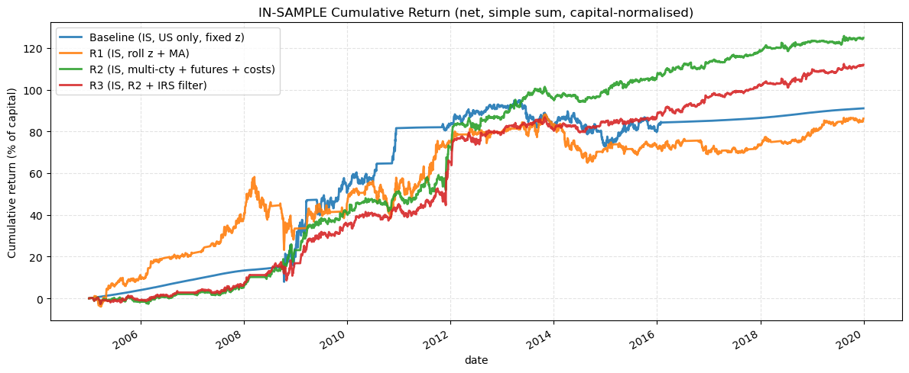
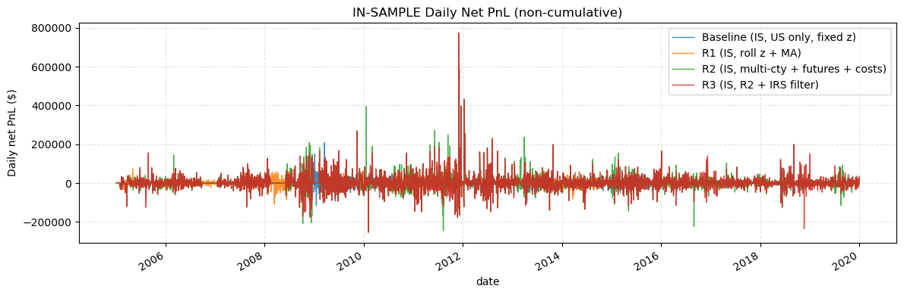
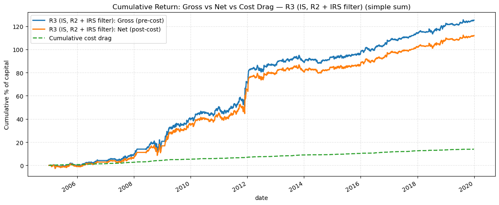
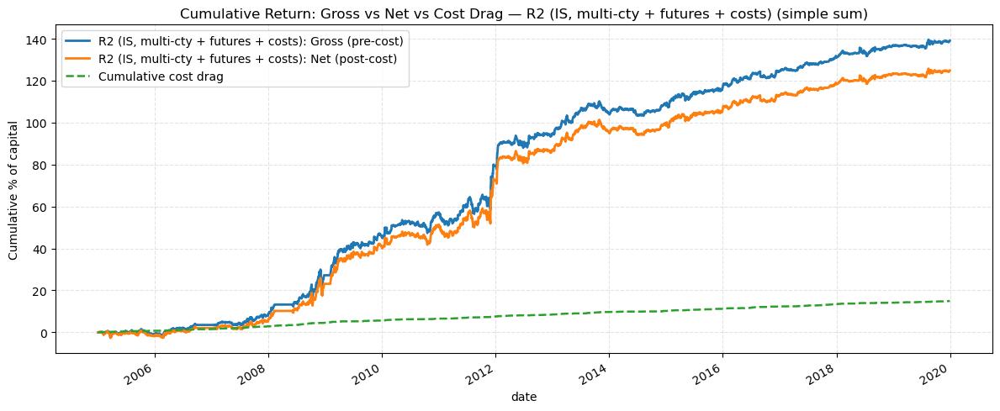
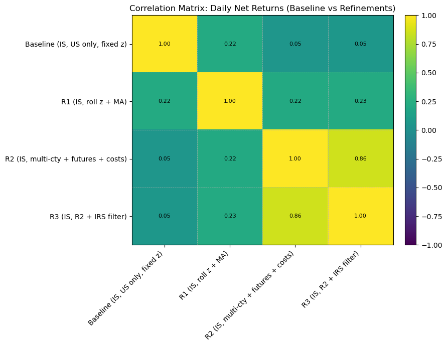
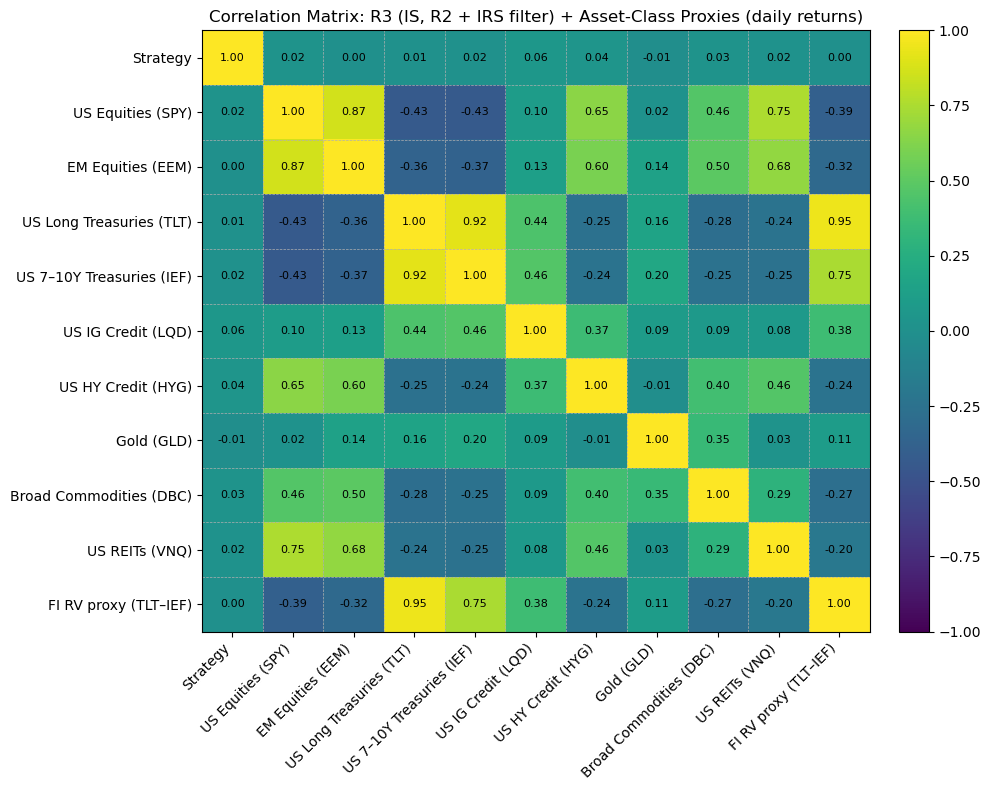
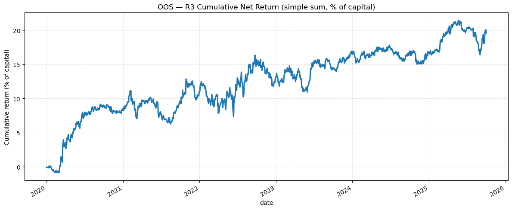
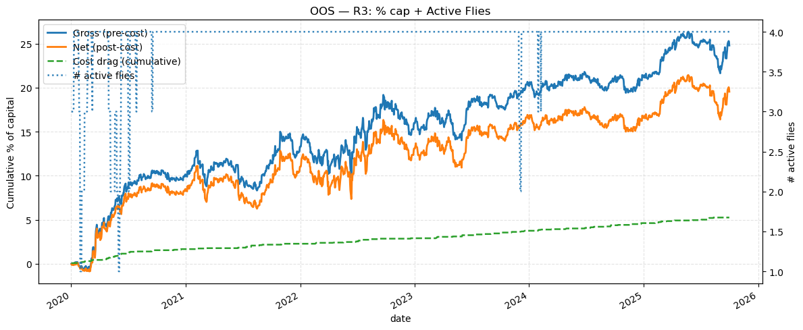

# Yield Curve Arbitrage in Fixed Income Markets

**MATHGR5300 Hedge Fund Strategies | Fall 2025 | Group A**

This repository contains the final research report, data workbook, and reproducible notebook for a systematic **DV01-neutral yield curve butterfly arbitrage strategy**. The strategy targets temporary curvature dislocations in sovereign rates markets, using carry-and-roll-down signals, rolling Z-score normalization, transaction-cost modelling, and an optional government-versus-IRS confirmation filter.

> Academic research project only. This is not investment advice and is not suitable for live trading without further validation, production risk controls, and execution infrastructure.

---

## Executive Summary

Yield curves exhibit persistent level, slope, and curvature structure, but the relative pricing of the curve's "belly" versus its "wings" can be distorted by macro news, auctions, dealer balance-sheet constraints, hedging flows, and risk-on/risk-off positioning. The project converts that intuition into a systematic relative-value strategy:

- Build butterfly trades such as **2s5s10s** and **5s10s30s** across liquid sovereign curves.
- Size each fly to be **DV01-neutral**, reducing first-order exposure to parallel rate moves.
- Estimate expected **carry and roll-down** over a short holding horizon.
- Normalize fly-level CRD signals using a rolling Z-score so the entry rule adapts across regimes.
- Enter high-conviction richness/cheapness signals and exit when the signal mean-reverts.
- Add transaction costs, futures implementation constraints, portfolio risk limits, and IRS confirmation.

The final specification, referred to in the notebook as **R3 / E3**, is the multi-country strategy with futures where available, realistic transaction costs, and an IRS confirmation filter.

---

## Strategy Architecture

### Trade Structure

A yield curve butterfly combines three tenors:

- **short wing**
- **belly**
- **long wing**

The belly is traded against the two wings. Weights are chosen so the package is approximately **self-financing and DV01-neutral**, meaning the fly is designed to isolate curvature rather than make a directional bet on the overall level of interest rates.

### Signal Engine

For each country and fly:

1. Fit and align sovereign yield curves from the Bloomberg-style workbook.
2. Estimate each leg's carry and roll-down under an unchanged-curve assumption.
3. Combine leg-level values into a fly-level CRD signal using DV01-neutral weights.
4. Smooth the raw signal with a 5-day moving average.
5. Convert the smoothed signal into a rolling Z-score using a 126-trading-day window.
6. Optionally require the government curve and IRS curve signals to agree in sign.

### Trading Rules

| Rule | Setting |
|---|---:|
| Entry threshold | `abs(Z) >= 1.6` |
| Exit threshold | `abs(Z) <= 0.2` |
| Signal smoothing | 5 trading days |
| Rolling Z-score window | 126 trading days |
| Maximum concurrent flies | 4 |
| Per-fly DV01 budget cap | 25% of total DV01 budget |
| Total DV01 budget | 100,000 |
| Idle capital proxy | SOFR-style daily cash accrual |

The entry and exit thresholds follow the common mean-reversion pattern of entering at roughly 1.5-2.0 standard deviations and exiting near zero, while using a slightly tighter exit band to reduce stale exposure.

---

## Implementation Universe

### Countries

The project supports sovereign curve inputs for:

| Region | Countries |
|---|---|
| North America | United States, Canada |
| Europe | Germany, United Kingdom, Italy |
| Asia-Pacific | Japan, Australia |

### Instruments

Two implementation sleeves are represented:

- **Curve sleeve:** zero-coupon-equivalent exposures derived from fitted sovereign yield curves.
- **Futures sleeve:** liquid listed futures where available, including US Treasury futures, German Bund-family futures, and UK Gilt futures proxies.

The futures sleeve is used only for higher-conviction signals and only where the relevant contracts are sufficiently liquid. Countries or tenors without robust futures coverage remain in the curve-based implementation sleeve.

---

## Backtest Variants

| Variant | Description |
|---|---|
| Baseline | US-only fixed-Z specification |
| R1 | Rolling Z-score plus moving-average smoothing |
| R2 | Multi-country strategy with futures sleeve and transaction costs |
| R3 / E3 | R2 plus IRS confirmation filter |

The in-sample period is calibrated through **2019-12-31**. The out-of-sample test evaluates the final R3 / E3 specification from **2020 onward**.

---

## Performance Snapshot

### In-Sample Results

| Strategy | Ann. Return Net | Ann. Vol Net | Sharpe Net | Max DD Net | Calmar | Sortino | Round Trips | Hit Rate |
|---|---:|---:|---:|---:|---:|---:|---:|---:|
| Baseline, US only, fixed Z | 5.919% | 8.239% | 0.718 | -11.368% | 0.521 | 0.659 | 5 | 80.000% |
| R1, rolling Z + MA | 5.600% | 10.309% | 0.543 | -22.149% | 0.253 | 0.650 | 47 | 74.468% |
| R2, multi-country + futures + costs | 8.515% | 6.942% | 1.227 | -6.681% | 1.275 | 1.939 | 234 | 73.077% |
| R3, R2 + IRS filter | 7.657% | 6.632% | 1.155 | -7.491% | 1.022 | 1.823 | 217 | 72.811% |

### Out-of-Sample Result

| Strategy | Ann. Return Net | Ann. Vol Net | Sharpe Net | Max DD Net | Calmar | Sortino | Round Trips | Hit Rate |
|---|---:|---:|---:|---:|---:|---:|---:|---:|
| R3 / E3, 2020 onward | 3.309% | 4.931% | 0.671 | -4.859% | 0.681 | 0.971 | 71 | 71.831% |

The final model trades less aggressively than the broad R2 specification, but the IRS confirmation filter is intended to reduce false positives and improve robustness across rates regimes.

---

## Selected Results

### In-Sample Strategy Comparison

### Cost Drag and Active Flies

### Strategy Variant Correlations

### Correlation to Asset-Class Proxies

### Out-of-Sample Performance

---

## Data Inputs

The main data source is the Bloomberg-style Excel workbook:

- [`Yield curve arb.xlsx`](Yield%20curve%20arb.xlsx)

Expected workbook sheets:

| Sheet | Contents |
|---|---|
| `Yield Signals` | Daily sovereign par yields by country and tenor |
| `IRS` | Daily IRS curves by country and tenor, used for confirmation |
| `Futs` | Daily futures settlement prices for liquid futures proxies |

The loader assumes Bloomberg's wide export convention with repeated date columns such as `Date`, `Date.1`, and so on. If the workbook format changes, the parsing logic in the notebook may need to be updated.

The repository also includes CSV inputs in [`Data/`](Data/):

- [`treasury_curve.csv`](Data/treasury_curve.csv)
- [`event_calendar.csv`](Data/event_calendar.csv)

---

## Repository Contents

| Path | Description |
|---|---|
| [`Finalised_Codebase.ipynb`](Finalised_Codebase.ipynb) | Final reproducible notebook for signal generation, backtests, diagnostics, and plots |
| [`[GroupA FI Yield Curve Arb].pdf`](%5BGroupA%20FI%20Yield%20Curve%20Arb%5D.pdf) | Final written report |
| [`Yield curve arb.xlsx`](Yield%20curve%20arb.xlsx) | Bloomberg-style input workbook |
| [`Data/`](Data/) | Supporting CSV inputs |
| [`assets/`](assets/) | Exported figures used in this README |

---

## Reproducibility

Open and run [`Finalised_Codebase.ipynb`](Finalised_Codebase.ipynb) from the repository root. The notebook performs the full workflow:

1. Load and align sovereign curve, IRS, and futures data.
2. Build CRD-based fly signals.
3. Construct fixed-Z, rolling-Z, multi-country, futures, transaction-cost, and IRS-filtered variants.
4. Run in-sample backtests for Baseline, R1, R2, and R3.
5. Run the final R3 / E3 out-of-sample backtest from 2020 onward.
6. Generate PnL, cumulative return, drawdown, turnover, cost, and correlation diagnostics.

Recommended Python stack:

- `pandas`
- `numpy`
- `matplotlib`
- `openpyxl`
- `scipy`

---

## Key Risks and Limitations

- DV01-neutrality reduces first-order level exposure but does not eliminate slope, curvature, convexity, liquidity, or basis risk.
- The curve sleeve is a theoretical proxy; real-world bond execution would introduce repo, specialness, financing, coupon, tax, and liquidity effects.
- Futures-to-tenor mappings are approximate and can create hedge mismatch.
- Carry-and-roll-down signals can fail during structural regime shifts, policy shocks, QE/QT transitions, and persistent supply-demand imbalances.
- Transaction-cost assumptions are conservative but still simplified relative to live execution.
- Results are based on historical data and should not be interpreted as evidence of future profitability.

---

## Contributors

- **Nigel Li**: research direction, methodology design, theoretical framework, and paper drafting
- **Ryan Hou**: implementation, backtesting, robustness analysis, and risk diagnostics
- **Jesse Price**: code review, visualization checks, and design feedback

---

## Citation and Disclaimer

This repository was prepared for Columbia MATHGR5300 Hedge Fund Strategies, Fall 2025. It is intended solely for academic research and classroom discussion. It does not constitute financial advice, an offer to trade, or a production trading system.
